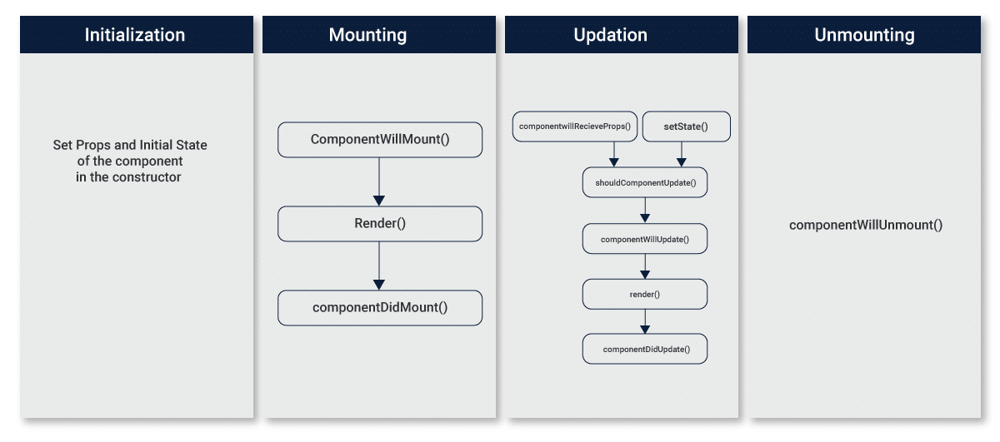

# React Cơ bản

## 1. Giới thiệu

React là một thư viện JavaScript phát triển bởi Facebook. Nó được sử dụng rộng rãi trong phát triển ứng dụng web để xây dựng giao diện người dùng (UI) tương tác và dễ dàng quản lý trạng thái của ứng dụng. React đã trở thành một trong những công cụ phổ biến nhất cho việc phát triển giao diện người dùng trong các dự án web lớn và nhỏ.

## 2. Cài đặt

Yêu cầu: Node JS, NPM

Kiểm tra xem máy đã cài chưa

```bash
node --version
npm --version
```

Tạo 1 dự án React cơ bản:

Sử dụng `vite` để tạo ra 1 dự án React cơ bản.

Link tham khảo: [Vite](https://vitejs.dev/guide/)

```bash
npm create vite@latest react-app -y
```

```
Select a framework: React
Select a variant: JavaScript
```

```bash
cd react-app
npm install
npm run dev
```

## 3. Những thứ nên học

### 3.1. JSX trong React JS

- JSX là viết tắt của JavaScript XML.
- Nó cho phép viết HTML trong JavaScript.
- JSX làm cho việc viết UI trở nên dễ dàng và trực quan hơn.

Ưu điểm:

- Cú pháp dễ đọc và viết.
- Hỗ trợ lập trình khai báo (declarative programming).
- Tăng hiệu suất bằng cách tối ưu hóa các quá trình biên dịch.

```js
const element = <h1>Hello, world!</h1>;
```

### 3.2. Component trong React

Trong React, **component** là một phần cơ bản của việc xây dựng giao diện người dùng. Component là các khối xây dựng độc lập và có thể tái sử dụng trong ứng dụng React. Chúng giúp tách biệt logic và giao diện người dùng, làm cho mã nguồn dễ dàng quản lý và phát triển.

Có hai cách chính để định nghĩa một component trong React:

1. Function Components: Đây là cách định nghĩa component bằng cách sử dụng một hàm JavaScript. Function component là một hàm JavaScript nhận vào các đối số (thường là props) và trả về một phần tử JSX (giao diện người dùng).

Ví dụ về một function component đơn giản:

```js
import React from "react";

function Welcome(props) {
  return <h1>Hello, {props.name}</h1>;
}

export default Welcome;
```

2. Class Components: Đây là cách định nghĩa component bằng cách tạo một lớp JavaScript kế thừa từ React.Component hoặc React.PureComponent. Class component có thể chứa phương thức và trạng thái (state).

Ví dụ về một class component đơn giản:

```js
import React, { Component } from "react";

class Welcome extends Component {
  render() {
    return <h1>Hello, {this.props.name}</h1>;
  }
}

export default Welcome;
```

Khi đã định nghĩa một component, có thể sử dụng nó trong ứng dụng React bằng cách gọi tên của nó như một thẻ HTML.

Ví dụ sử dụng component trong ứng dụng React:

```js
import React from "react";
import Welcome from "./Welcome"; // Đường dẫn đến file chứa component

function App() {
  return (
    <div>
      <Welcome name="John" />
      <Welcome name="Alice" />
    </div>
  );
}

export default App;
```

### 3.3. Props (Properties):

- Props là một cách để truyền dữ liệu từ component cha (parent component) xuống component con (child component).
- Props là các giá trị không thay đổi (immutable) được truyền vào một component như các thuộc tính (attributes).
- Component con sử dụng props để hiển thị dữ liệu hoặc xử lý các sự kiện.
- Props giúp tái sử dụng component và làm cho chúng linh hoạt và độc lập.

```js
// Component con (ChildComponent.js)
import React from "react";

function ChildComponent(props) {
  return <div>Hello, {props.name}!</div>;
}

// Component cha (ParentComponent.js)
import React from "react";
import ChildComponent from "./ChildComponent";

function ParentComponent() {
  return <ChildComponent name="John" />;
}
```

### 3.4. State

- State là một cách để quản lý trạng thái của một component và làm cho nó có khả năng thay đổi trong quá trình chạy (mutable).
- State thường được sử dụng trong các class component, và bạn có thể khởi tạo và cập nhật state bằng phương thức `setState()`.
- Thay đổi state thường dẫn đến việc render lại (re-render) component để cập nhật giao diện người dùng.
- State thường được sử dụng trong class components, không được sử dụng trong function components (trước React 16.8). Từ React 16.8 trở đi, bạn có thể sử dụng state trong function components bằng cách sử dụng Hooks.

**State trong Class Components**

```js
import React, { Component } from "react";

class Counter extends Component {
  constructor() {
    super();
    this.state = {
      count: 0,
    };
  }

  incrementCount = () => {
    this.setState({ count: this.state.count + 1 });
  };

  render() {
    return (
      <div>
        <p>Count: {this.state.count}</p>
        <button onClick={this.incrementCount}>Increment</button>
      </div>
    );
  }
}
```

**State trong Function Components**

```js
import React, { useState } from "react";

function Counter() {
  // Sử dụng useState để khởi tạo state với giá trị ban đầu là 0
  const [count, setCount] = useState(0);

  // Hàm xử lý sự kiện tăng giá trị count lên 1
  const increment = () => {
    setCount(count + 1); // Cập nhật giá trị state
  };

  return (
    <div>
      <p>Count: {count}</p>
      <button onClick={increment}>Increment</button>
    </div>
  );
}

export default Counter;
```

### 3.5. Sự Kiện và xử lý sự kiện trong React:

Trong React, bạn có thể sử dụng sự kiện bằng cách thêm các thuộc tính sự kiện vào các phần tử JSX.

1. Click:

```jsx
<button onClick={handleClick}>Click me</button>
```

2. Change(input):

```js
<input type="text" onChange={handleChange} />
```

3. Submit (Form):

```js
<form onSubmit={handleSubmit}>{/* Các trường input và nút submit */}</form>
```

4. Mouse Over và Mouse Leave:

```js
<div onMouseOver={handleMouseOver} onMouseLeave={handleMouseLeave}>
  Hover me
</div>
```

### 3.6. Lifecycle trong React JS

- Lifecycle (vòng đời) của một component mô tả quá trình từ khi component được khởi tạo (mount) cho đến khi nó bị loại bỏ khỏi DOM (unmount).
- Trong quá trình này, component trải qua nhiều giai đoạn, mỗi giai đoạn có các phương thức lifecycle đặc trưng.



1. Mounting (Khởi tạo)

Mounting là quá trình khi một component được tạo và chèn vào DOM.

Các phương thức trong giai đoạn này:

- `constructor(props)`: Phương thức đầu tiên trong lifecycle. Dùng để khởi tạo state và ràng buộc phương thức.
- `static getDerivedStateFromProps(props, state):`Dùng để cập nhật state dựa trên props ban đầu.
- `render():` Duy nhất bắt buộc. Trả về các phần tử React cần hiển thị.
- `componentDidMount():` Được gọi sau khi component được chèn vào DOM. Thường dùng để tải dữ liệu từ một API, thiết lập subscriptions hoặc timers.

2. Updating (Cập nhật)

Updating xảy ra khi props hoặc state của một component thay đổi, dẫn đến việc re-render component.

Các phương thức trong giai đoạn này:

- `static getDerivedStateFromProps(props, state):` Gọi mỗi khi component nhận props mới.
- `shouldComponentUpdate(nextProps, nextState):` Cho phép quyết định xem component có nên cập nhật không.
- `render():` Re-render UI dựa trên state và props mới.
- `componentDidUpdate(prevProps, prevState, snapshot):` Được gọi sau khi component cập nhật và re-render. Dùng để thực hiện các hoạt động sau khi cập nhật.

3. Unmounting (Loại bỏ)
   Unmounting là quá trình loại bỏ component khỏi DOM.
   Phương thức trong giai đoạn này:

- `componentWillUnmount():` Gọi trước khi component bị loại bỏ khỏi DOM. Dùng để thực hiện dọn dẹp như hủy bỏ network requests, xóa subscriptions, hủy bỏ các timers hoặc counters.

```js
class MyComponent extends React.Component {
  constructor(props) {
    super(props);
    // Khởi tạo state
  }

  componentDidMount() {
    // Tải dữ liệu, thiết lập subscriptions
  }

  componentDidUpdate(prevProps, prevState) {
    // Phản ứng với thay đổi
  }

  componentWillUnmount() {
    // Dọn dẹp
  }

  render() {
    // Render UI
  }
}
```

#### 3.6.1. Sử dụng `useEffect` trong Functional Components

1. Cơ bản về `useEffect`

- `useEffect` cho phép bạn thực hiện side effects trong functional components.
- Nó có thể thay thế cho hầu hết các trường hợp sử dụng của lifecycle methods trong class components.
- Cú pháp cơ bản:

```js
useEffect(() => {
  // Code thực thi ở đây sẽ chạy sau mỗi lần render.
}, []);
```

2. Mô Phỏng `componentDidMount`

- Để chạy useEffect một lần sau khi component được mount, bạn cung cấp một mảng rỗng [] làm dependency array.

```js
useEffect(() => {
  // Code ở đây sẽ chỉ chạy một lần sau khi component được mount.
}, []);
```

3. Mô Phỏng `componentDidUpdate`

- useEffect sẽ chạy lại mỗi khi một giá trị trong dependency array thay đổi

```js
useEffect(() => {
  // Code này chạy khi giá trị của 'dependency' thay đổi.
}, [dependency]);
```

4. Mô Phỏng `componentWillUnmount`

- Trả về một hàm từ bên trong useEffect sẽ thực thi trước khi component bị unmount.

```js
useEffect(() => {
  // Thiết lập hoặc thực hiện side effect.

  return () => {
    // Code ở đây sẽ chạy trước khi component bị unmount.
  };
}, []);
```
